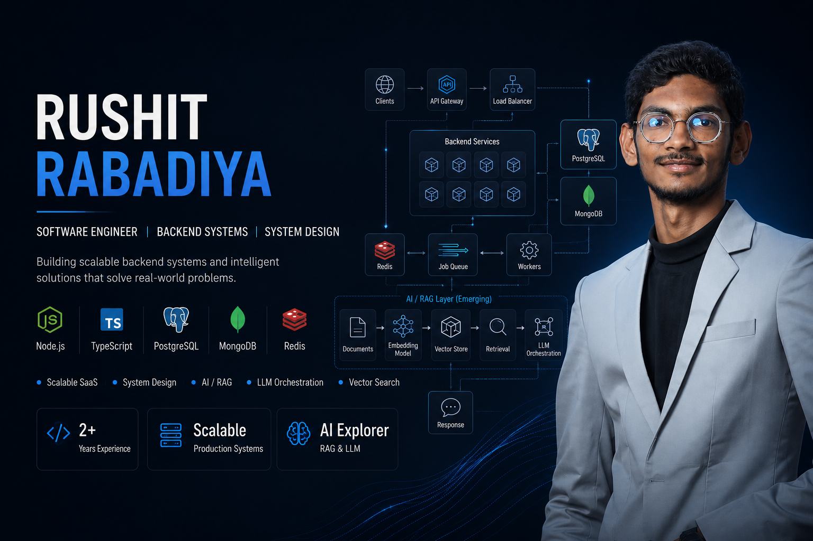

  

  

  
  &nbsp;
  
  &nbsp;
  

  
  &nbsp;
  
  &nbsp;
  

<!-- 

  
  &nbsp;
  

 -->

 

  

 

 

## 👨‍💻 About Me

> **Rushit Rabadiya**
> _Senior Software Engineer @ Edzyme Tech Pvt Ltd_
> 📍 Ahmedabad, Gujarat, India | ⏱️ 2.5+ Years of Experience
> ✉️ **Contact:** [rushitrabadiya.work@gmail.com](mailto:rushitrabadiya.work@gmail.com) | 🌐 **Portfolio:** [rushitrabadiya.github.io](https://rushitrabadiya.github.io/)

Software Engineer with 2.5+ years of professional experience — plus 6 months of backend development internship experience — building scalable backend systems using Node.js, Express.js, and TypeScript. Strong in RESTful API design, hybrid database architecture (PostgreSQL, MongoDB, Redis), and containerized deployment (Docker, AWS EC2/S3, CI/CD). Experienced owning backend architecture end-to-end, from system design through production deployment. Currently exploring applied AI as a growing area alongside backend engineering, with hands-on experimentation in RAG pipelines, vector databases, LLM integration, and multi-provider AI orchestration.

**Core Competencies:**

- 🏛️ **Backend Architecture** (Node.js / TypeScript)
- 🗄️ **Hybrid Database Design** (PostgreSQL + MongoDB)
- ⚡ **Async Processing** (Redis + BullMQ)
- 🤖 **Exploring AI & RAG Pipelines** (LLM Orchestration)
- ☁️ **Cloud & DevOps** (Docker, AWS, CI/CD)
- 🤝 **Team Collaboration** (Working closely with a 6-engineer team)
- 🎯 **Status** (Available for new opportunities)

 

### 🚀 What I bring to the table

> I specialize in building scalable, reliable backend systems that hold up under real production load.

- 🏗️ **Backend Architecture** — Own end-to-end system design for production systems serving concurrent users with `< 100ms` API latency.
- 🗄️ **Hybrid Databases** — Designed and integrated PostgreSQL + MongoDB architectures matched to data consistency needs.
- ⚡ **Async Processing** — Built Redis + BullMQ pipelines for push notifications, PDF generation, and payment webhook reconciliation.
- 🤖 **Exploring AI / RAG Systems** — Implemented multi-provider LLM failover (Gemini → Groq → Ollama) using `pgvector` for retrieval.
- ☁️ **DevOps & Cloud** — Managed deployments on AWS (EC2/S3) using Docker, Nginx, and automated GitHub Actions CI/CD pipelines.
- 🤝 **Collaboration** — Work closely with the engineering team on architecture decisions, PR reviews, and production releases.

 

---

 

## Tech Stack

 

<h4 align="center">⚙️ Backend & Database</h4>

  
  
  
  
  
  
  
   
  
  
  
  
  
  

 

<h4 align="center">🧠 AI & Machine Learning (Exploring)</h4>

  
  
  
  
  

 

<h4 align="center">☁️ DevOps, Frontend & Tools</h4>

  
  
  
  
  
   
  
  
  
  
  
  

 

---

 

## GitHub Analytics

<!--
  NOTE: The badges below are generated by third-party services
  (github-readme-stats, github-profile-trophy, etc.). These occasionally
  go down or get rate-limited and show as broken/plain-text links —
  that's a service-side issue, not a bug in this file. They typically
  come back within a few hours. If a specific one stays broken long-term,
  swap its subdomain/instance (community-run mirrors exist for most of these).
-->

  
  &nbsp;
  

  

  

  

  

 

---

 

## Work Experience

 

### Edzyme Tech Pvt Ltd _(Dec 2024 → Present · 1 yr 9 mos)_

**Senior Software Engineer** _(Jan 2026 → Present)_

> Promoted to own end-to-end backend architecture and system design for **Kipi**, an enterprise SaaS/ERP platform for educational institutes.
> Collaborate closely with the engineering team on technical decisions, code architecture, and PR reviews.
> Own deployment processes and production releases, maintaining **API latency under 100ms** at peak load.

`Node.js` `TypeScript` `PostgreSQL` `MongoDB` `Redis` `BullMQ` `Docker` `AWS`

 

**Back End Developer** _(Dec 2024 → Jan 2026)_

> Built core backend features for **Kipi**, including fee billing, wallet transactions, and academy management modules.
> Designed a hybrid database architecture (PostgreSQL + MongoDB) with asynchronous processing pipelines (Redis, BullMQ) for notifications, PDF generation, and payment reconciliation.
> Integrated PhonePe payments and Socket.io real-time features, including live notifications and in-app chat.

`Node.js` `TypeScript` `PostgreSQL` `MongoDB` `Redis` `BullMQ`

---

### Stackdot _(May 2023 → Dec 2024 · 1 yr 4 mos)_

**Junior Backend Developer** _(Mar 2024 → Dec 2024)_

> Built and maintained scalable backend applications using Node.js and Express.js across multiple projects.
> Worked with both PostgreSQL and MongoDB, adapting the data layer to each project's needs.
> Designed secure RESTful APIs with JWT-based authentication, RBAC, and input validation.

`Node.js` `Express.js` `PostgreSQL` `MongoDB` `JWT`

 

**Backend Developer Intern** _(May 2023 → Oct 2023)_

> Designed and integrated RESTful APIs for communication between frontend and backend systems.
> Worked with Node.js and Express.js to build backend services, learning asynchronous, middleware, and event-driven architectures.
> Worked with PostgreSQL and MongoDB across different projects based on application requirements.
> Collaborated with the development team to build scalable and maintainable backend solutions.

`Node.js` `Express.js` `JavaScript` `PostgreSQL` `MongoDB` `REST APIs`

 

---

 

## Certifications

  
  &nbsp;
  
   
  
  &nbsp;
  

 

---

 

## Contribution Snake

  <picture>
    <source media="(prefers-color-scheme: dark)" srcset="https://raw.githubusercontent.com/rushitrabadiya/rushitrabadiya/output/github-contribution-grid-snake-dark.svg"/>
    <source media="(prefers-color-scheme: light)" srcset="https://raw.githubusercontent.com/rushitrabadiya/rushitrabadiya/output/github-contribution-grid-snake.svg"/>
    
  </picture>

 

---

 

## Dev Quote

  

 

---

## Connect

  
  &nbsp;
  
  &nbsp;
  
   
  

 

  

  
  &nbsp;
  

